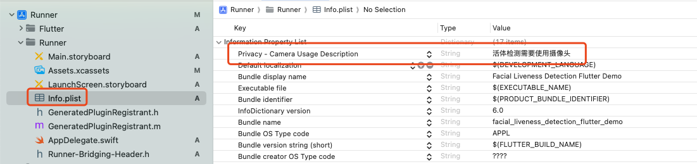

# facial_liveness_detection_flutter_demo

人脸活体检测 flutter 插件样例工程 ， 插件地址： https://pub.dev/packages/facial_liveness_detection_flutter_plugin

效果如下：


## Getting Started

1. 增加插件依赖 :   flutter pub add facial_liveness_detection_flutter_plugin   
2. 增加其他依赖 ：  flutter pub add http

#### Android

1. 增加摄像机权限
2. 在 android/build.gradle 中增加 aar 依赖, 如下：
```
allprojects {
    repositories {
        google()
        mavenCentral()
        flatDir {
            dirs project(':facial_liveness_detection_flutter_plugin').file('libs')
        }
    }
}
```

#### IOS

1. 增加摄像机权限，如下




## 其他信息
1. 完整接入文档：https://esandinfo.yuque.com/yv6e1k/aa4qsg/hpxvm3vphsq4oh3g
3. 后端管理控制台地址: http://openali.esandcloud.com
4. 技术支持/定制化开发请联系
```
微信：esand_info
qq: 3626921591
电话：13691664797
邮箱：reid.li@foxmail.com
```

